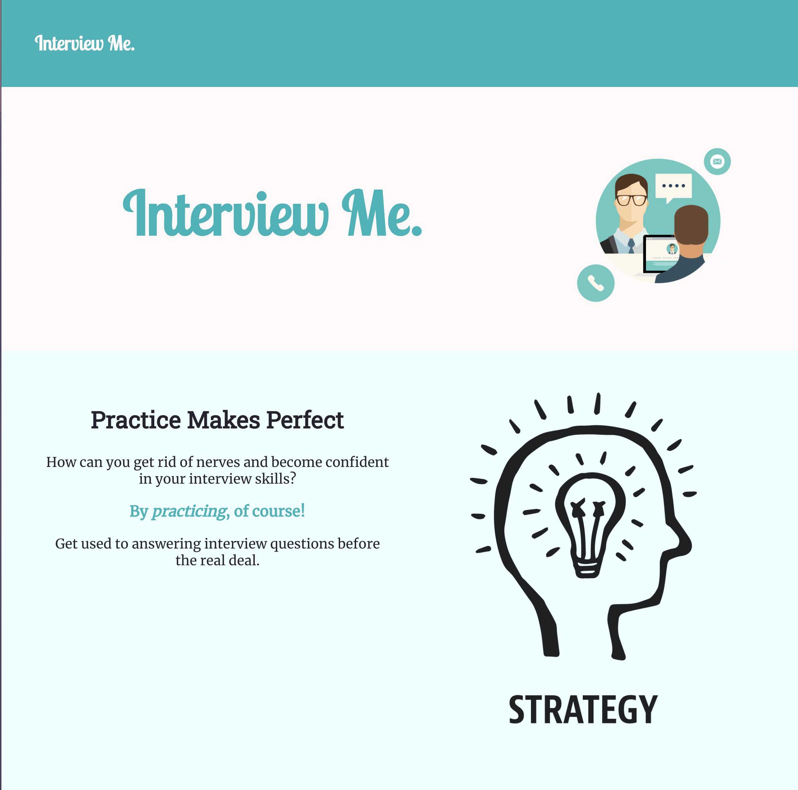
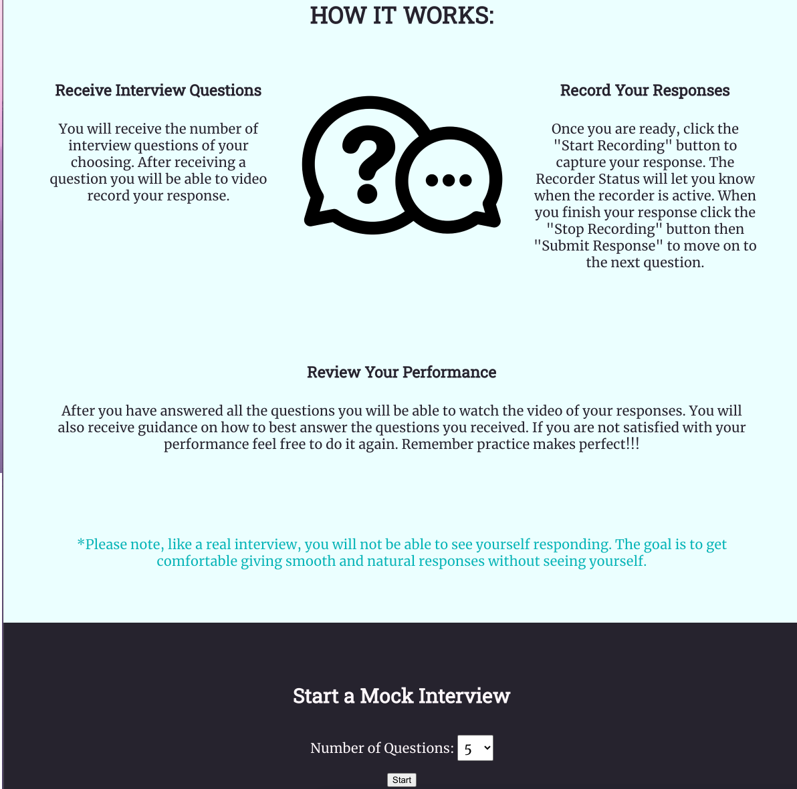
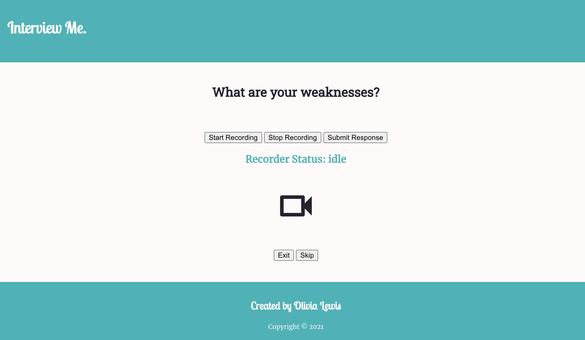
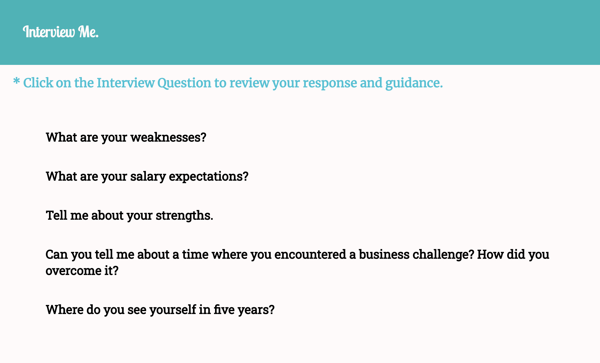
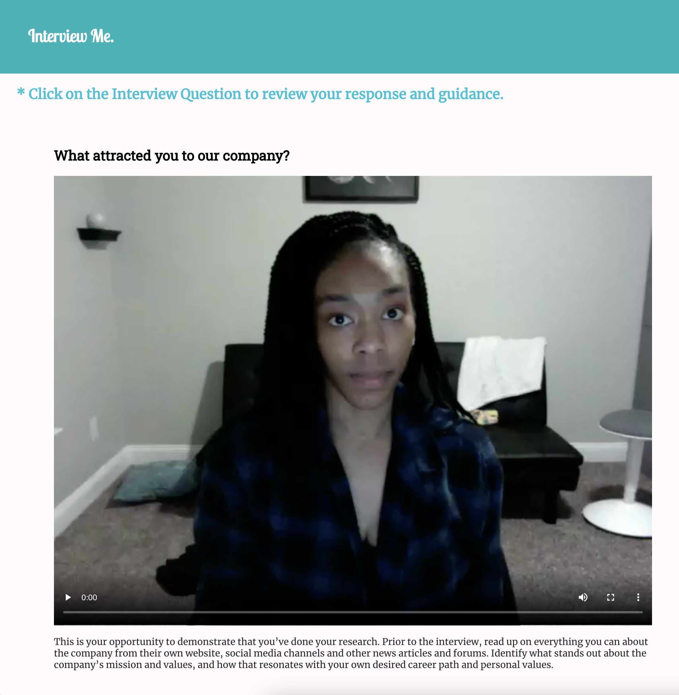

Interview Me
=============
This App helps to prepare Job Seekers(Users) for interviews by prompting them with interview questions. The User will be able to video-record then review their responses.

Live App: [Interview Me](https://interview-me.vercel.app/)

Backend Repo: [Interview Me API](https://github.com/ollythedeveloper/interview-me-api)

Screenshots
-----------
Landing Page:

Interview Prompt:

Results:

Results - Selected Question/Response:

Technology Used
---------------
* HTML
* CSS
* Javascript
* jQuery
* React
* Node
* Express
* PostgreSQL
